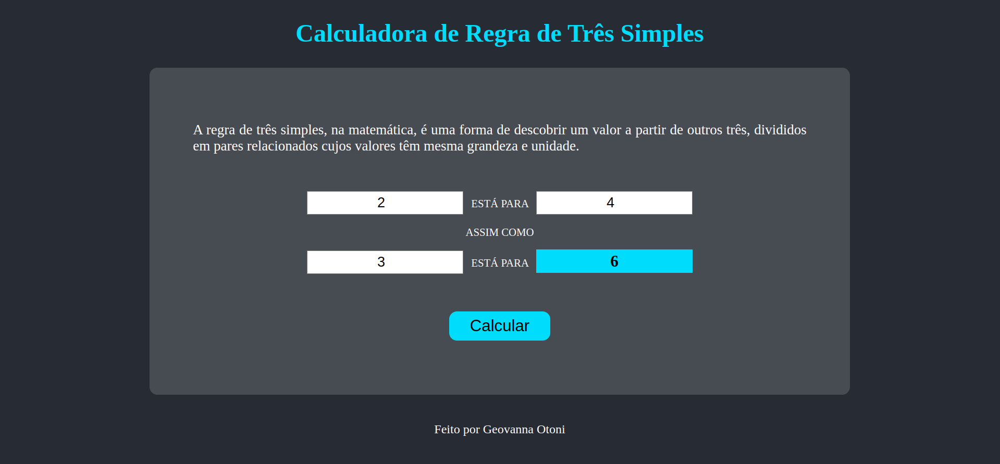

# Calculadora de Regra de Três Simples
Projeto Pessoal de construção de uma Calculadora de Regra de Três Simples.

## :computer: Visualize este projeto:
Acesse pelo GitHub Pages aqui: 

## :bulb: Habilidades:
Feito a partir dos conhecimentos de CSS, HTML, JavaScript, DOM e Eventos.